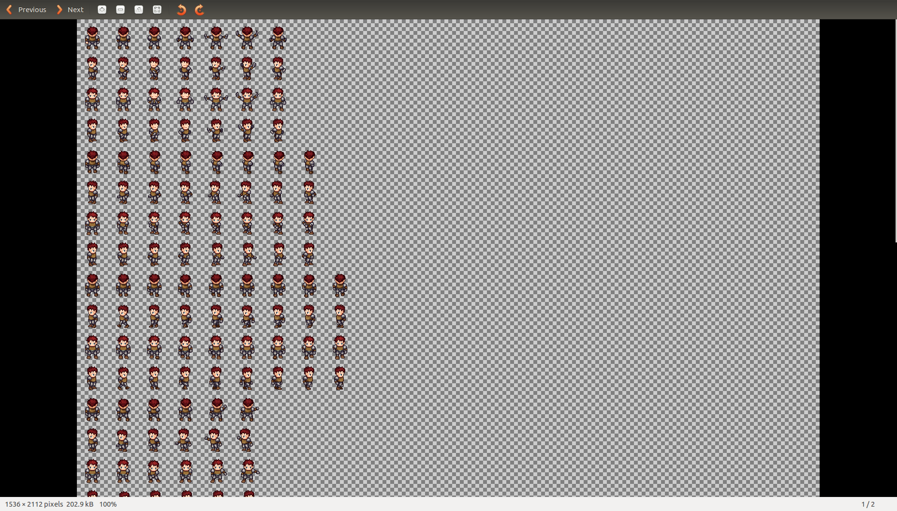
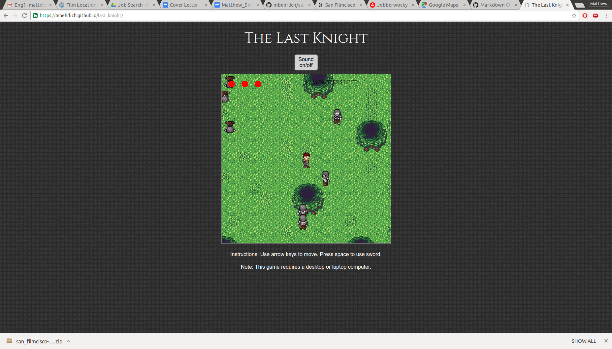

# The Last Knight of the Last Kingdom

[The Last Knight](https://mbehrlich.github.io/last_knight)

This is a javascript game in the vein of the original Legend of Zelda.

## Technologies used

1. Vanilla Javascript - for game logic
2. HTML5 Canvas - for visual components
3. [Universal LPC Spritesheet Character Generator](http://gaurav.munjal.us/Universal-LPC-Spritesheet-Character-Generator/) - for character art assets

## MVP Features:

1) Character animation and movement. The player and skeletons both have a single image
spritesheet. As the user holds down the keys, I use the exact measurements of each frame
with canvas to iterate through the spritesheet, and display the current movement.

2) Movement - The player is not actually moving. The background is moving while the player
stays put. There are two types of tiles I used, ones that the player can move through and
ones the player cannot (like the trees and water). The background is randomly generated
each playthrough. Each tile has an absolute position on the map, and is displayed based on its
distance from the player. There is also a game logic class that keeps track of obstacles so
that the player cannot walk through objects.

3) Enemies - The skeleton enemies have the same movement and animation logic as
the player, except that they stay still on the map until the player gets close enough,
and then move towards the player.

4) Combat - When enemies tough the player, the player has a short period of invincibility.
Using the sword kills skeletons in a small area in front of the player.
